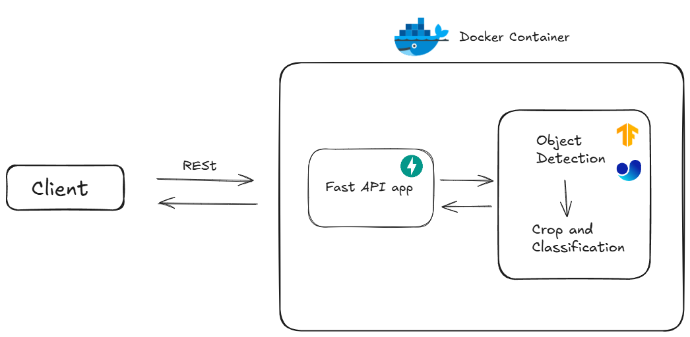

## Architecture of ML Deployment


## How to deploy
1. Docker Build in this directory
```
docker build -t ml-deployment .
```
2. Run container 
```
docker run -d -p 80:80 --name ml-container ml-deployment
```
You can check the container with ```docker ps``` 

## API Specification
### Request
- method : `POST`
- URL : `baseUrl/predict`
- Header : `multipart/form-data`
- Body :
    - file : an image (File)
    - validation : a json key value (Text)
        - smell : str
        - texture : str
        - verifiedShop : bool

### Response
- Body:
    - prediction : str
    - confidence : float